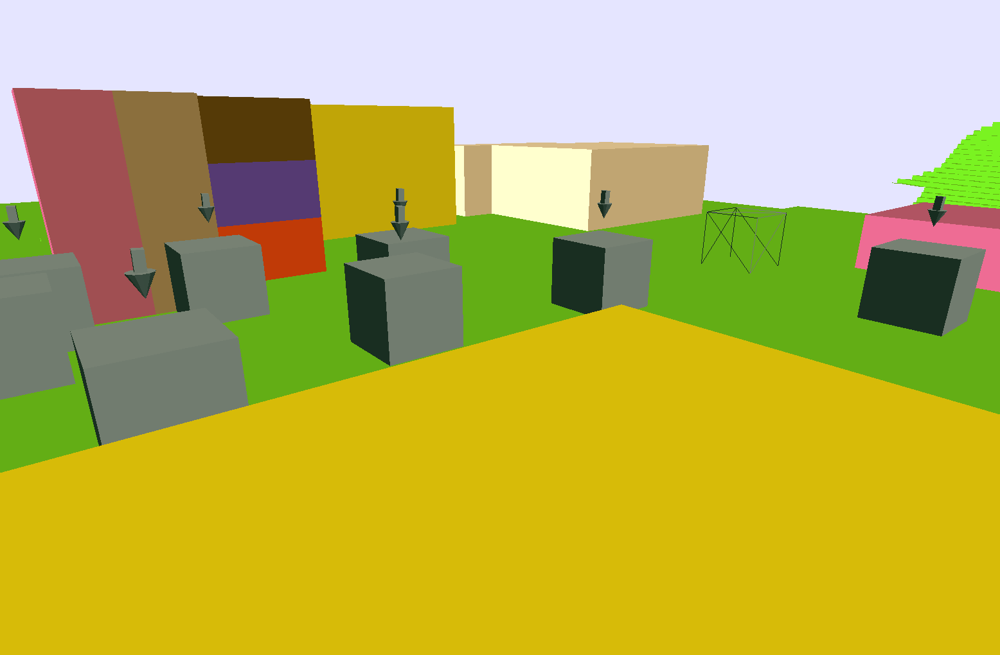
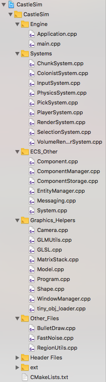
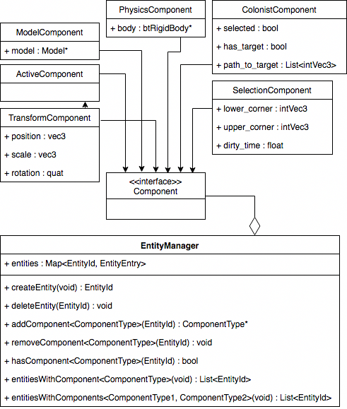

# Game Of Stones

More info: [alexsaalberg.com/gos.html](https://alexsaalberg.com/gos.html)

## Description

Game of Stones was my senior project. It was created in a little under 10 weeks. 

It was meant to be an exploration into the type of speciality controls that might be needed to make a fully-3D "Colony Simulator" type game. (Imagine [Rimworld](https://rimworldgame.com/) rendered in Minecraft). 

Most of the time was spent simply making the rendering engine, but some basic controllable 'colonists' npcs were added as well as some interesting 3D voxel building controls

## Technologies

Language - C++

Source Control - Git

Building - CMake1
### Libraries

#### [Polyvox](http://www.volumesoffun.com/polyvox-about/)

Used for management of voxel data, generation of triangle meshes from voxel data, and for some of it's pathfinding utility functions.

#### [BulletPhysics3](https://github.com/bulletphysics/bullet3)

Used for physics simulation (duh).

#### [GLFW](https://github.com/glfw/glfw)

Used for creating/managing windows and user input.

#### [Glad](https://github.com/Dav1dde/glad)

Used for loading OpenGL functions.

#### [Imgui](https://github.com/ocornut/imgui)

User for debug output.

## Controls
  It’s important to understand that there are two conceptual “control modes” in this game. They are called “RTS mode” and “FPS mode.” They can be switched between by hitting the “G” key. There are some controls that are available in both modes.
  
  In FPS mode it is easier to move around and place/destroy individual blocks. Controls in this mode are fairly identical to the game ‘Minecraft’. (Left Click to destroy, Right Click to build).
  
  In RTS mode it is possible to select (LeftClick) and direct (RightClick) colonists (the grey cubes). It is also possible to select 3D volumes of the world (LeftMouse+Drag). Once a volume is selected it can be used to select multiple colonists at once, or destroy and build blocks.

Here is a summary of the controls available
#### Both Modes
* WASD to move
* Space to jump
* 1-9 select block color 
* Hit G to switch control modes

#### FPS Mode
* Move Mouse to change camera
* Left Click to destroy
* Right Click to build

#### RTS Mode
* Hold Right-Click and Move Mouse to change camera
* Left-Click to select a colonist
* Right-Click to tell all selected colonists to move somewhere
* Left-Drag to create a selection
  * Hit B to build in selection
  * Hit V to delete in selection
  * Hit C or Left-Click to cancel selection
  * Hit F to select colonists in selection

# Behind The Scenes

## General Code Structure

While peeking into the src/ folder may lead you to believe this project has no structure, this is not true. The CMakeLists within the project will put the proper source files into the proper directories in the IDE of your choice. 

*Example of XCode Project Navigator*

## Entity-Component-System Pattern

### Background Info

Game of Stones uses the [ECS Programming Pattern](https://en.wikipedia.org/wiki/Entity%E2%80%93component%E2%80%93system) to define it's game objects. This pattern favors "composition over inheritence" and is generally used to combat the problems that game engines can have of using traditional object inheritance to define hundreds of different game objects with overlapping, but slightly differing, properties.

ECS is used in game engines both because of the possible performance benefits due to better [data locality](http://gameprogrammingpatterns.com/data-locality.html), and because it can make a game engine simpler and more managable in a surprising number of ways.

### Implementation

This part of the engine was implemented in a fairly straightforward fashion. Each entity is nothing more than an ID (int). Each component type has its’ own storage manager which ultimately stores all components of the same type in a contiguous array or a hashmap. There is roughly one system for each game mechanic (e.g. RenderSystem, PhysicsSystem, ColonistSystem) which is automatically called each frame or physics step and can query the EntityManager to get entities with one or more components as needed. For example, every frame the RenderSystem renders every entity with a TransformComponent and a ModelComponent.

### Systems

*Pretty much all game logic is implemented in these Systems, which have functions called either on Physics Steps or Graphics Steps (or both)*

* **ChunkSystem**
  * On each Physics Step 
    * Calculates which chunks are within view-range and loads/unloads them as necessary. (Like in minecraft)
    * Calls PolyVox to created MeshData for newly loaded chunks. (Limits how many are created per step to prevent lag).
      * Also calls PolyVox to recreate MeshData for dirty chunks (only modified by PlayerSystem).
  * On each Graphics Frame
    * Renders the meshdata for all loaded chunks.
* **ColonistSystem**
  * On each Physics Step
    * For each colonist which has a target destination
      * move them towards the next point on the A* path towards the destination.
      * Jump if necessary 
* **InputSystem**
  * On each Physics Step
    * For each control in control_map (Can contain mouse or key controls)
      * If that control was activate in the last step
        * Make note of it in the control map (Other systems can ask InputSystem which controls were active at any time)
      * (Incoming controls are stored by GLFW until polled) 
* **PhysicsSystem**
  * On each Physics Step
    * For each Entity with a Physics_Component AND a Position_Component
      * Update that entities Position_Component to the positions in the BulletPhysics world.
* **PlayerSystem**
  * On each Physics Step
    * If in RTS Mode
      * Do relevant controls for 3D selectiosn / colonists orders based upon input.
    * If in FPS Mode
      * Do relevant controls for walking / camera movement / building.
* **RenderSystem**
  * On each Graphics Step
    * Render each entity with a Model_Component AND Position_Component
* **SelectionSystem**
  * On each Physics Step
    * Create a PolyVox volume for each active selection. (The visualized selections in the world are just transparent voxels)
* **VolumeRenderSystem**
  * On each Graphics Step
    * Render each RawVolume_Component 
      * (These can be anything we want to render with a voxel volume rather than a traditional triangle model)
      * Currently, this is just the 3D selections.

### Components

*Which entity has which component is designated by a bitset vector in EntityManager. (Each component has a bitset, each bit designates if a entity has a particular component*

* **Active_Component**
  * Holds no data
  * Designates if a entity is active or not.
  * Removing this component is equivalent to deleting a entity. (It's id will be reused for new entities)
* **Model_Component**
  * Holds a triangle mesh model
* **RawVolume_Component**
  * Holds a voxel volume of limited size (used for selections)
* **PagedVolume_Component**
  * Holds a voxel volume of unlimited size (used for the voxel world/landscape)
* **Position_Component**
  * Holds an entities position and rotation
* **Camera_Component**
  * Holds an offset of from the position to the camera 'eyes' (Vec3)
  * Designates an entity as the camera
* **Colonist_Component**
  * Holds information related to colonists pathfinding and selecting
  * Designates an entity as a colonist
* **Selection_Component**
  * Holds information related to selections
* **Physics_Component**
  * Holds a BulletPhysics rigid body

*NOTE!: Ignore the erroneous arrow between TransformComponent and ActiveComponent*

## Naming Conventions
* Variables (local and member)
  * snake_case 
* Classes
  * PascalCase
* Functions
  * camelCase

